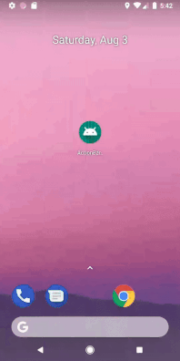

# Manage the options menu at runtime using Java.



## Introduction.

In this application we have created an options menu in action bar using **java code**.

### Note : 

In this project [ActionBar_OptionMenu_Xml_Android_Github](https://github.com/amansharma-dev/ActionBar_OptionMenu_Xml_Android_Github/ "ActionBar_OptionMenu_Xml_Android_Github.") we have inflate menu items using **xml file**.

## Defining Options Menu using Java

To create menu items using java code, override `onCreateOptionsMenu(Menu menu){ }` and add this piece of code inside it, 

```
        MenuItem menuItemOne = menu.add(Menu.NONE,Menu.NONE,101,"Menu Item One");

        menuItemOne.setOnMenuItemClickListener(new MenuItem.OnMenuItemClickListener() {
            @Override
            public boolean onMenuItemClick(MenuItem item) {
                Toast.makeText(getApplicationContext(),"Menu 1 Clicked",Toast.LENGTH_SHORT).show();
                return false;
            }
        });

        MenuItem menuItemTwo = menu.add(Menu.NONE,Menu.NONE,102,"Menu Item Two");
        menuItemTwo.setEnabled(false);

        MenuItem menuItemThree = menu.add(Menu.NONE,Menu.NONE,103,"Menu Item Three");
        menuItemThree.setEnabled(false);

        MenuItem menuItemFour = menu.add(Menu.NONE,Menu.NONE,104,"Menu Item Four");
        menuItemFour.setOnMenuItemClickListener(new MenuItem.OnMenuItemClickListener() {
            @Override
            public boolean onMenuItemClick(MenuItem item) {
                Toast.makeText(getApplicationContext(),"Menu 4 Clicked",Toast.LENGTH_SHORT).show();
                return false;
            }
        });

        MenuItem menuItemFive = menu.add(Menu.NONE,Menu.NONE,105,"Menu Item Five");
        menuItemFive.setEnabled(false);


        return true;
    }
```

In above code I've added Toast message on *MenuItemOne* & *MenuItemFour*. I have dimmed out *MenuItemTwo , Three & Five* by adding this piece of code `menuItemTwo.setEnabled(false);` to each 

# Thank You.

